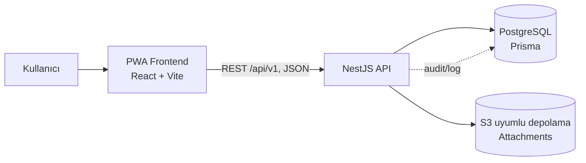
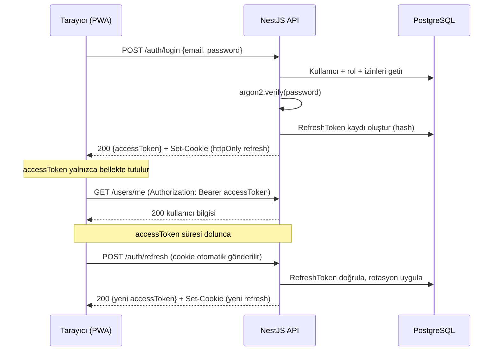
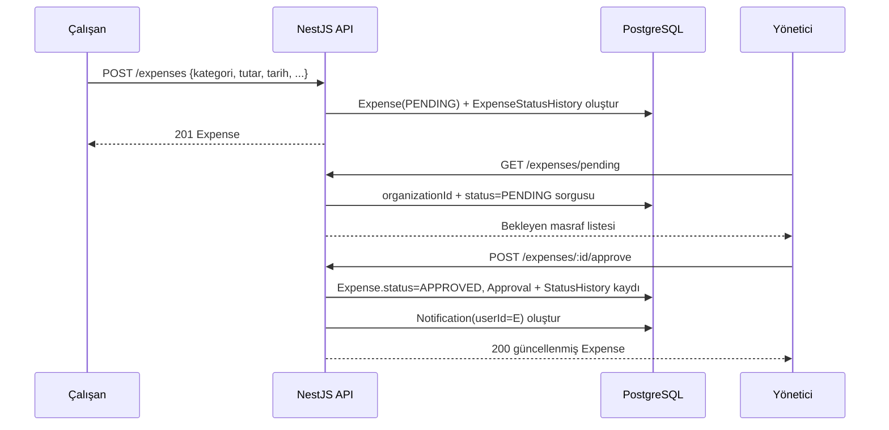

# Mimari

## Genel Bakış

Sistem, ilk sürümde bilinçli olarak **modüler monolith** olarak tasarlanmıştır: tek bir
NestJS API süreci, modüller arası net sınırlarla (her modül kendi controller/service/DTO
katmanına sahiptir) ama tek bir dağıtım birimi olarak çalışır. Mikroservis mimarisi bu
aşamada gereksiz operasyonel karmaşıklık getireceği için tercih edilmemiştir; modüller
ileride ayrı servislere bölünebilecek şekilde (Prisma erişimi yalnızca kendi servisleri
üzerinden, cross-module doğrudan repository erişimi yok) sınırlandırılmıştır.

## Katmanlar

| Katman | Sorumluluk |
| --- | --- |
| `apps/web` | Kullanıcı arayüzü, PWA kabuğu, kimlik doğrulama akışı (UI) |
| `apps/api` | İş kuralları, RBAC, veri erişimi, dosya depolama koordinasyonu |
| `packages/shared-types` | Frontend/backend arasında paylaşılan TS tipleri |
| `packages/shared-validation` | Zod şemaları — hem backend (ZodValidationPipe) hem frontend (react-hook-form resolver) aynı kuralı kullanır |
| PostgreSQL | Kalıcı ilişkisel veri |
| S3 uyumlu depolama | Fiş/fatura dosyaları (yalnızca metadata veritabanında) |

## Multi-tenant yaklaşımı

Her iş verisi (`User`, `Department`, `Expense`, `Attachment`, ...) `organizationId` alanı
taşır. Yetkilendirme katmanında:

1. `JwtStrategy` erişim jetonundaki `organizationId`'yi `request.user`'a yazar.
2. Servis katmanı her sorguyu `organizationId` ile filtreler (bkz. `UsersService`,
   `ExpensesService`).
3. `OrganizationScopeGuard`, URL'de `:organizationId` parametresi taşıyan uçlarda
   kullanıcının kendi organizasyonu dışına çıkmasını engeller.

Bu yaklaşım, ileride tam bağımsız şema/veritabanı izolasyonuna (schema-per-tenant)
geçişe de temel oluşturur; bugünkü satır bazlı izolasyon, düşük operasyonel maliyetle
başlamak için tercih edilmiştir.

## Kimlik doğrulama akışı

## Masraf oluşturma ve onay akışı

## Neden bu kararlar?

- **REST, GraphQL değil**: Ekip aşinalığı, Swagger ile otomatik dokümantasyon, basit
  CRUD ağırlıklı bir domain için yeterli.
- **Prisma**: Tip güvenli sorgular, migration sistemi, PostgreSQL'e özgü tiplerle
  (`Decimal`, `Uuid`) iyi entegrasyon.
- **Zod tek doğrulama kaynağı**: `packages/shared-validation`, hem backend hem frontend
  tarafından import edilir; iş kuralı iki yerde ayrı ayrı yazılmaz.
- **Access token bellekte, refresh token httpOnly cookie**: bkz.
  [security.md](security.md).
